
**被傻儿子埋怨，先关闭一段时间**

# 前言
参考[@guimaizi](https://github.com/guimaizi/get_domain)师傅的子域名收集与监测V3.0，以及练习Django时长两周半完成的一套Src子域名资产检测系统。

LangSrcCurise资产监控系统是一套通过网络搜索引擎监控其下指定域名，并且能进行持续性信息收集整理的自动化资产监控管理系统，基于Django开发。

**本项目仅进行资产持续收集监控，无漏洞利用、攻击性行为，请使用者遵守当地相关法律，勿用于非授权测试，如作他用所承受的法律责任一概与作者无关，下载使用即代表使用者同意上述观点。**

# 需要环境

1. python==3.6
2. mysql==8.0
3. nmap==7.8
4. django==2.1.1

# 安装环境

## Linux 用户

依次安装以下服务：

1. python3.6
2. nmap
3. sudo python3 -m pip install -r requirement.txt
4. MySQL8.0

**注意：在linux下执行任何生成数据库，启动任何服务命令前都需要加上 sudo**

## Windows 用户

依次执行如下操作：

1. python3.6
2. nmap并添加到环境变量
3. python3 -m pip install -r requirement.txt
4. MySQL8.0

# 开始使用

## 开启mysql服务

1. 第一步先开启mysql服务，并且允许用户连接
2. 设置MySQL最大连接数为512，最大插入缓存数据量为200M

推荐mysql.ini设置如下：

	[mysql]
	default-character-set=utf8

	[mysqld]
	port=3306
	character-set-server=utf8
	default-storage-engine=InnoDB
	max_connections=512
	max_connect_errors=10
	max_allowed_packet = 200M
	log-error="E:/phpstudy_pro/Extensions/MySQL8.0.12/error.log"  
	default_authentication_plugin=mysql_native_password 
	# 这里的日志输出自己修改路径

## 配置数据库信息

在主目录下的 config.ini 文件中修改相关mysql登陆信息

	[Server]
	host = 127.0.0.1 # mysql登陆的ip，linux下设置为localhost，也可以填写服务器远程IP
	port = 3306		# mysql 端口
	username = root
	password = root
	dbname = LangSrcCurise # 你要是用的数据库名字，数据库自动创建

## 初始化数据库

在 LangSrcCurise 文件夹下依次执行如下命令：

1. python3 manage.py makemigrations
2. python3 manage.py migrate
3. python3 manage.py createsuperuser # 按照提示注册生成管理员账号密码

## 初始化监控域名

编辑域名：在 initialize 文件夹 编辑 domains.list 文件

执行命令：在 主目录 LangSrcCurise 文件夹下依次执行如下命令：

1. python3 manage.py initial

完成将监控域名初始化到数据库

## 配置网址过滤黑名单

	Auxiliary/Black_Url.list

其下的网址都会被自动过滤，请勿修改文件名

## 配置子域名爆破字典

	Auxiliary/SubDomainDict.list

通过连续爆破二十个SRC，每个SRC测试10W条子域名字典，获取存活的子域名的方式过滤的高质量子域名字典，请勿修改文件名

## 启动服务

在 LangSrcCurise 文件夹下依次执行如下命令：

1. python3 manage.py runserver 0:8888

## 添加用户

添加的用户可以在前端获取数据，并且能够在前端添加查询数据

访问网址：http://127.0.0.1:8888/lsrc/

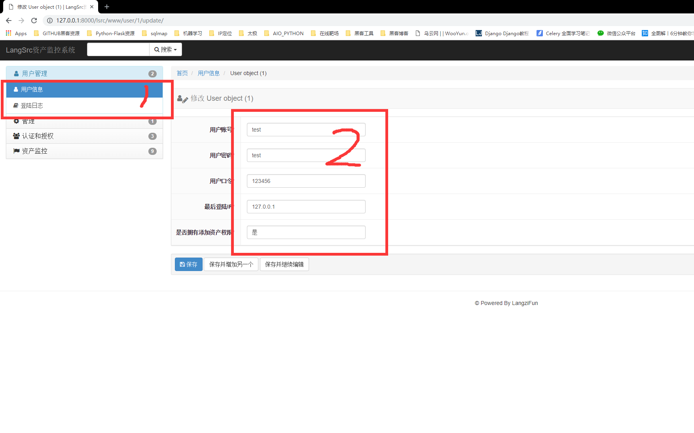

可供选项：

**是否拥有添加资产权限：是/否**

如果设置成否，则该账号无法在前端添加资产数据。

## 扫描设置

设置扫描策略，线程数进程数以及运行入库状态码

这张表只能存在一列数据，其中配置方案名称随便填写，允许入库状态码即该网址返回的状态码，如果符合这个表的内容，则保存到数据库，实际上是一个过滤规则，注意其中的数据格式参考python的列表，并且是英文输入法下的,和[]。

比如：

	配置方案：随便取个名字
	允许入库状态码：[200,301,302,404]
	

因为数据任务都是同时在跑，所以比较吃资源，建议线程等数量都设置在4或者以下

## 开启扫描

在 LangSrcCurise 文件夹下依次执行如下命令：

1. python3 manage.py startscan

如果出现大量的Mysql数据库报错，关闭窗口重新执行上命令

需要管理员权限

**默认不会扫描网址对应IP主机的端口服务，可以开启但是速度会降低，并且目前没有检测CDN，酌情处理，不建议开启**

如果需要开启端口扫描以加快子域名获取：

取消注释		

	core/Run_Tasks.py  

第110行和111行

**还能扫描C段信息，可以但没必要**

## 后续

如果需要删除所有的数据库，然后重新开始扫描，执行如下步骤：

1. 直接在数据库中删除，或者在config.ini将数据库名修改成一个新的名字
1. 执行命令 python3 manage.py makemigrations
2. 执行命令 python3 manage.py migrate
3. 执行命令 python3 manage.py createsuperuser # 按照提示注册生成管理员账号密码

前面步骤设置完毕后，每次如果需要启动，可以如下步骤：

启动mysql：sudo service mysql start

启动WEB：python3 manage.py runserver 0:8888

启动扫描程序：python3 manage.py startscan

访问地址：http://ip:8888  前台

访问地址：http://ip:8888/lsrc  后台管理

**建议是每间隔72小时重启一次扫描端。**

# 监控流程

通过导入的监控域名表，自动循环执行如下任务：

1. 通过  baidu          进行子域名采集
2. 通过  bing           进行子域名采集
3. 通过  sougou         进行子域名采集
4. 通过  baidu，sertsh  接口进行子域名采集
4. 通过  ssl证书         进行子域名采集
5. 通过  子域名爆破       进行子域名采集
6. 通过  对资产网址爬行   进行子域名采集
7. 通过  域名服务器      进行端口扫描，服务探测
8. 通过  域名服务器      进行探测是否部署web服务
9. 通过  域名服务器      进行其他数据清洗管理

# 部署建议

web端部署在服务器，数据可以给小弟小妹们用，给他们生成几个用户账号。

**不建议使用服务器扫描资产**

自己使用超级管理员账号，如果只是想要简单的检索数据，在后端直接操作搜索即可，还可以导出各种格式的数据文件。

在服务器不建议开启扫描任务，开个WEB服务和数据库即可，本地扫描端直接连接远程服务器传输数据。

# Linux安装环境爬坑记录 （By child@0ye.pw）

下载该项目源码

	apt-get update
	
	git clone  https://github.com/LangziFun/LangSrcCurise.git

安装python3.6问题

	https://www.jianshu.com/p/2a5cd519e583

解决pip升级问题

	https://blog.csdn.net/lanluyug/article/details/82878152

	http://www.360doc.com/content/17/1124/17/43462428_706789375.shtml

阿里云腾讯云升级过后还不能安装pip

	https://www.jianshu.com/p/de7a5b734465

乌班图安装MySQL8.0

	https://www.linuxidc.com/Linux/2018-11/155408.htm

解决中文编码

	https://www.jianshu.com/p/4e2000920332

解决scapy安装问题

	https://github.com/giampaolo/psutil/issues/1143

Django连接MySQL出错

	https://www.cnblogs.com/ljd4you/p/8592765.html

MySQL配置优化
	
	https://www.cnblogs.com/lyq863987322/p/8074749.html
	https://blog.csdn.net/qingzhong_he2010/article/details/50708106
	https://blog.csdn.net/windxxf/article/details/6049716

MySQL8.0配置文件目录
	
	/etc/mysql/mysql.conf.d

	https://blog.csdn.net/PY0312/article/details/89481421
	cd /var/lib/dpkg/
	sudo mv info/ info_bak
	sudo mkdir info                 # 再新建一个新的info文件夹
	sudo apt-get update             # 更新
	sudo apt-get -f install         # 修复
	sudo mv info/* info_bak/        # 执行完上一步操作后会在新的info文件夹下生成一些文件，现将这些文件全部移到info_bak文件夹下
	sudo rm -rf info                # 把自己新建的info文件夹删掉
	sudo mv info_bak info

# 快速上手

## 后台

检索数据直接在后台搜索即可，支持导出各种格式的数据内容

### 用户信息表

- 存储用户账号密码口令数据
- 此处的用户只能在前台登陆进行简单数据查看

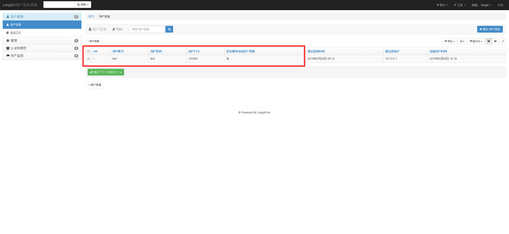

### 用户登陆日志表

- 存储用户登陆日期与登陆IP以及登陆状态

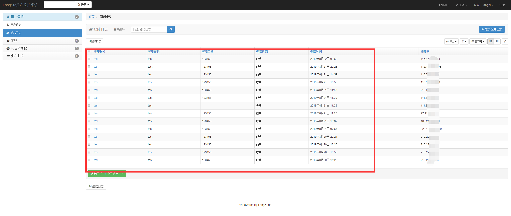

### 数据展示表

- 存储获取到的子域名资产详细数据
- 用作前台具体展示
- 用作设置是否进行手动挖掘漏洞标识

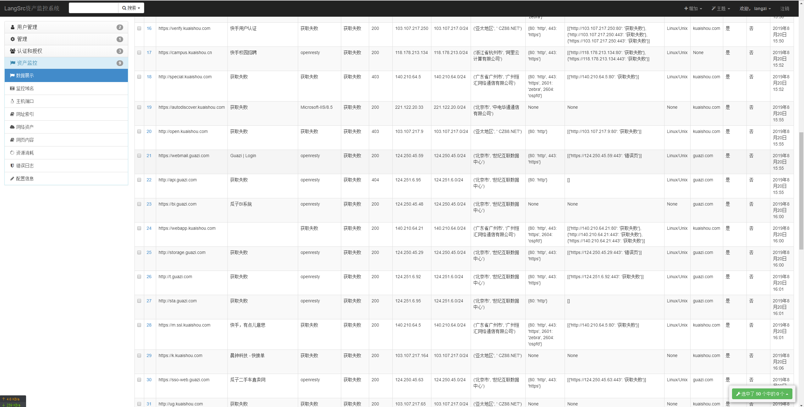

### 监控域名表

- 存储要进行监控的域名资产
- 存储域名相对于的企业备案信息
- 存储该域名子域名捕获数量

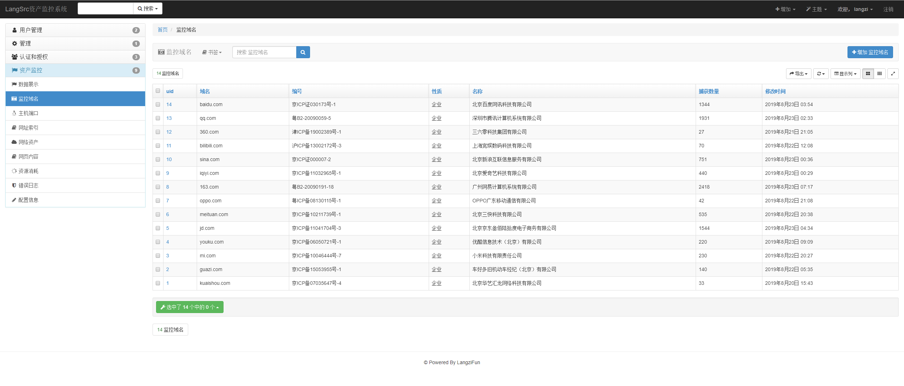

### 主机端口表

- 存储子域名对应IP相关开放端口，服务，所在地区

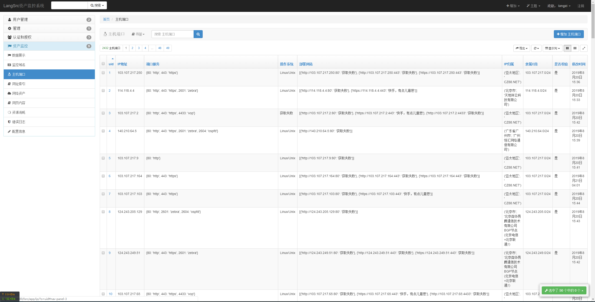

### 网址索引表

- 存储所有获取存活的子域名
- 判断该子域名是否进行网页爬行

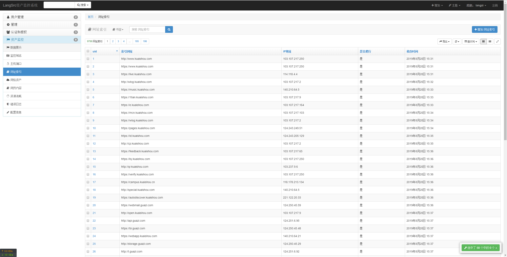

### 网络资产表

- 存储所有子域名标题，语言，服务器类型等信息
- 存储所有爬行友链等相关信息
- 可用来做WEB资产搜索引擎搜索

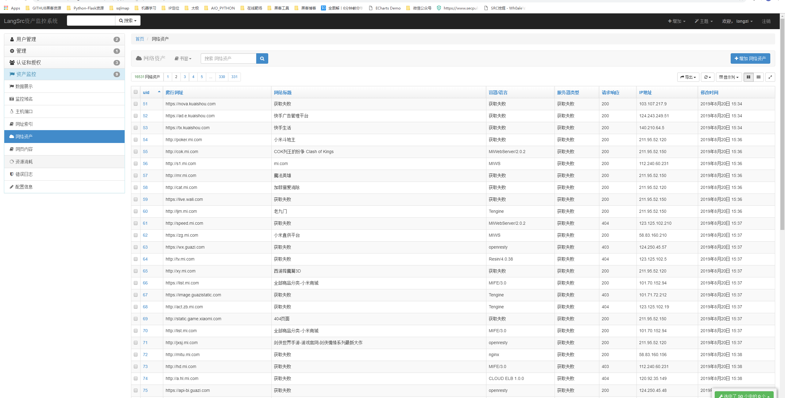

### 网页内容表

- 存储所有监控子域名的网页内容
- 作为数据展示表的外键关联，数据一致

### 资源消耗表

- 扫描端主机资源消耗

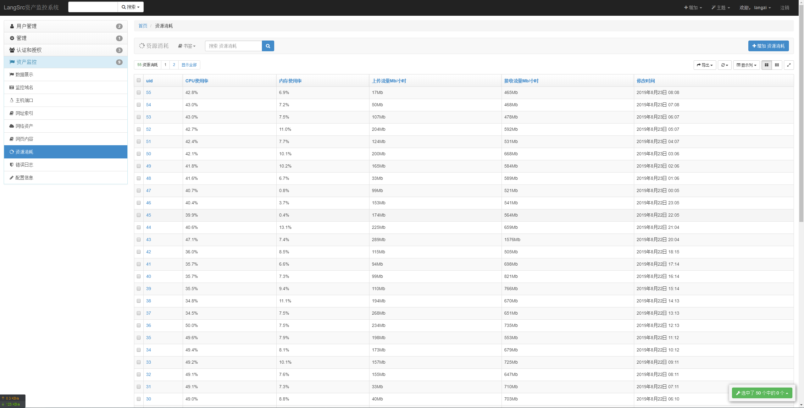

### 错误日志表

- 扫描过程中错误日志

### 配置信息表

- 扫描端线程等数据设置

## 前台

给与小弟小妹们查询数据使用

### 登陆处

- 需要账号密码口令等信息存在上文用户信息表

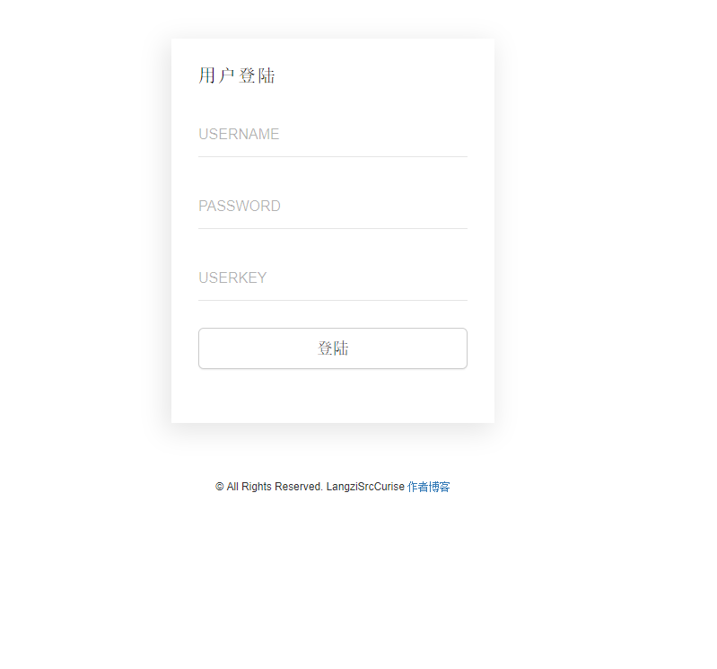

### 首页处

- 相关数据的展示内容
- 右上角可以手动添加子域名/IP资产
- 右侧为针对不容内容进行搜索栏

### 搜索结果

搜索结果根据不同内容返回

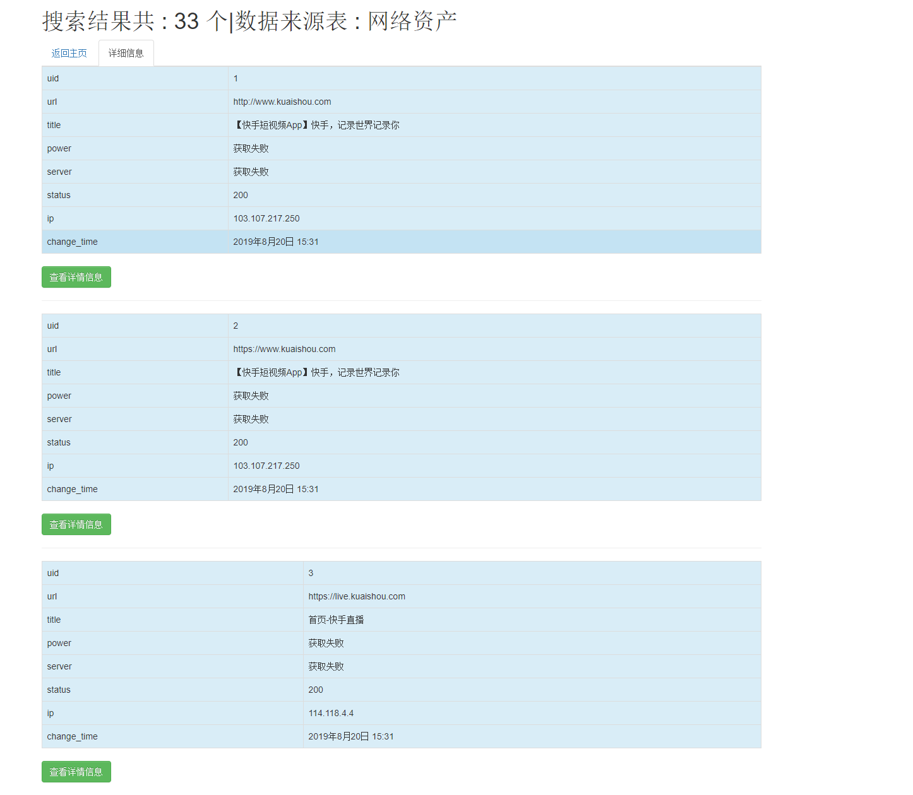

查看数据详情可以设置是否进行手动渗透测试

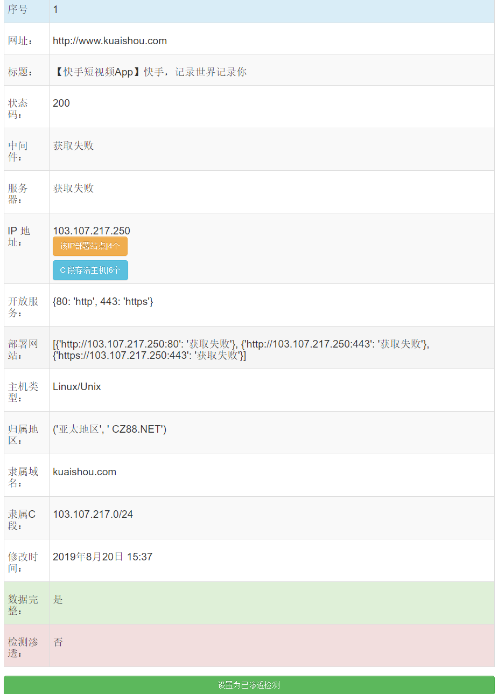